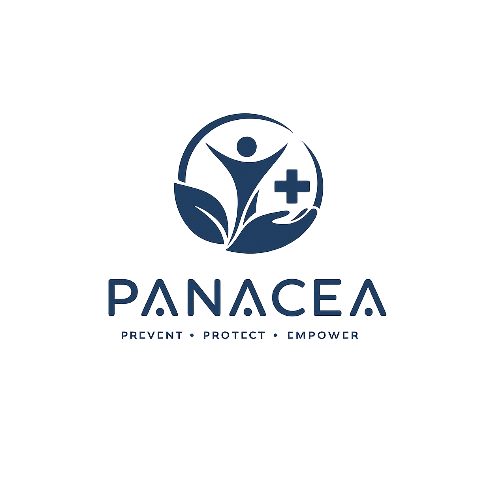

<p align="center">
  
</p>

<h1 align="center">PANACEA</h1>
<p align="center"><em>PREVENT · PROTECT · EMPOWER — Healthcare Beyond Words.</em></p>

<p align="center">
  <a href="https://github.com/Quackk08/ARK_PANACEA/releases">
    
  </a>
  <a href="https://github.com/Quackk08/ARK_PANACEA/graphs/contributors">
    
  </a>
  <a href="https://github.com/Quackk08/ARK_PANACEA/issues">
    
  </a>
  
  <a href="https://vercel.com">
    
  </a>
  
</p>

---

## About This Project

**PANACEA** is a web-based digital health platform built for the **16th e-ICON World Contest** by **Team ARK** from Daejeon Daeshin High School. This repository contains the **2nd deployment** (`v2.0.0`), a fully integrated build with AI symptom analysis, community heatmap, body atlas, and gamified prevention missions.

The platform is designed to prevent infectious diseases from spreading into large-scale community outbreaks — especially in **medically underserved regions** where literacy, internet connectivity, and hospital access are limited.

> **Slogan:** *Healthcare Beyond Words.*
> The entire app is navigable using icons, color, animation, and voice — no text comprehension required.

---

## Problem Statement

Preventable diseases like **malaria, dengue, tuberculosis, and influenza** continue to claim millions of lives annually — not because cures are unavailable, but because of four critical barriers:

| Barrier | Description |
|---|---|
| **Information Access** | ~763 million adults lack basic literacy (UNESCO). Most health apps are text-heavy and inaccessible. |
| **Symptom Recognition** | Fever, headache, fatigue overlap across many diseases — patients mistake serious illness for minor colds. |
| **Behavior Change** | Preventive habits (repellent, water removal, medication) are hard to sustain without motivation systems. |
| **Outbreak Detection Delay** | Official outbreak recognition occurs only after hospitals overflow. Communities need earlier warnings. |

PANACEA addresses all four with one integrated platform.

---

## Core Features

| Feature | Description |
|---|---|
| **Risk Dashboard** | Visual infection-risk level (Low / Medium / High) based on environmental and public health data. Daily prevention missions with XP rewards. |
| **AI Guidance** | Voice or tap-based symptom input → Gemini AI triage → top-3 disease probabilities with audio readout. Results logged and contributed to community heatmap. |
| **Body Atlas** | Interactive SVG human body (front & back). Tap body zones to explore disease-specific symptom clusters for Malaria, Dengue, Influenza, and TB — fully visual, zero text required. |
| **Community Heatmap** | Anonymous symptom reports aggregated by neighborhood and displayed as a density heatmap. Filter by disease tag to spot emerging outbreaks. |
| **Guardian Challenge** | Daily prevention missions (apply repellent, remove standing water, take medicine) that earn XP and unlock reward tiers. |
| **Profile & Health Log** | Full history of AI analysis sessions with symptom tags and diagnosis results per entry. |

**User flow:** Risk Awareness → Symptom Recognition → AI Guidance → Prevention Action → Community Monitoring → Early Warning

---

## Technology Stack

| Layer | Technology |
|---|---|
| **Framework** | Next.js 16 (App Router, Turbopack) |
| **Language** | TypeScript |
| **Styling** | Tailwind CSS v4 (Noto Serif / Manrope / JetBrains Mono) |
| **Backend / DB** | Supabase (Postgres + Row Level Security + Email OTP Auth) |
| **AI** | Google Gemini (`gemini-2.0-flash`) via `/api/analyse` |
| **Maps** | Leaflet + react-leaflet (CartoDB tiles) |
| **Voice** | Web Speech API — STT (input) + TTS (guidance readout, en-US) |
| **Hosting** | Vercel (2nd deployment — `v2.0.0`) |

> **Note:** The original proposal planned TensorFlow.js for on-device inference. The deployed version uses the Gemini API for higher accuracy AI guidance; offline-first TensorFlow.js integration is planned for a future stage.

---

## Team ARK

| | **Kim Sunmin** (김선민) | **Ryan Ahn Song** (송리안) |
|---|---|---|
| **Role** | Team Leader | Developer |
| **GitHub** | [@biro425](https://github.com/biro425) | [@Quackk08](https://github.com/Quackk08) |
| **School** | Daejeon Daeshin High School | Daejeon Daeshin High School |
| **Focus** | Backend architecture · Supabase integration · AI logic · Community heatmap & anonymization · Offline-first structure · Docker  | Frontend UI/UX · Next.js / React · TypeScript · Interactive SVG Body Interface · No-Text UX design · Tailwind CSS · Figma |
| **Languages** | C, C++, C#, JavaScript, TypeScript, Python | C, C++, C#, Python, JavaScript, TypeScript |
| **Tools** | Node.js, Firebase, Supabase, TensorFlow.js, Leaflet.js, GitHub, Docker |  React, Next.js, Tailwind CSS, TensorFlow.js, Firebase, Figma |

**Teacher advisor:** Park Jungeun (박정은), Daejeon Daeshin High School

---

## Deployment

| | Link |
|---|---|
| **Live App** | [panaceaforall.kro.kr](https://panaceaforall.kro.kr) |
| **GitHub** | [github.com/Quackk08/ARK_PANACEA](https://github.com/Quackk08/ARK_PANACEA) |
| **Deployment** | 2nd deployment · `v2.0.0` · Hosted on Vercel |

---

## Authentication Flow

Email-based **OTP (One-Time Password)** login via Supabase.

1. `/login` — enter email → Supabase sends 6-digit OTP
2. `/auth/verify` — enter code → session issued
3. Authenticated routes: `/dashboard`, `/profile`, `/ai-guidance`, `/guardian`, `/api/analyse`
4. Public routes (no login required): `/body-atlas`, `/heatmap`

---

## Local Setup

```bash
cd app
npm install
npm run dev
# Open http://localhost:3000
```

### Environment Variables (`app/.env.local`)

```env
NEXT_PUBLIC_SUPABASE_URL=https://<your-project>.supabase.co
NEXT_PUBLIC_SUPABASE_ANON_KEY=<your-anon-key>
GEMINI_API_KEY=<your-google-gemini-api-key>
RATE_LIMIT_SECRET=<random-server-secret>
```

> Never commit `.env.local` — it is blocked by `.gitignore`.

---

## Scripts

```bash
npm run dev     # Development server
npm run build   # Production build
npm run start   # Production server
npm run lint    # ESLint
```

---

## Project Structure

```
app/
├─ src/
│  ├─ app/
│  │  ├─ (app)/          # Authenticated screens: dashboard, profile, ai-guidance, guardian, body-atlas, heatmap
│  │  ├─ (auth)/         # Auth screens: login, auth/verify
│  │  ├─ api/analyse/    # Gemini-powered symptom analysis API (auth + rate limit + schema validation)
│  │  └─ page.tsx        # Landing page
│  ├─ components/        # UI · navigation · heatmap components
│  ├─ lib/               # Supabase client · Gemini client · types
│  └─ proxy.ts           # Next.js 16 route protection gate
└─ next.config.ts        # Security headers (CSP, HSTS, etc.)
```

---

## Security

- **Row Level Security** applied to all Postgres tables
- `/api/analyse` — server-side auth + per-user/IP distributed rate limit + symptom enum validation + LLM response schema validation
- `next.config.ts` — CSP · HSTS · X-Frame-Options · nosniff · Referrer Policy · Permissions Policy
- Heatmap anonymization: symptoms stripped of all identifiers on-device before transmission, aggregated at neighborhood level, displayed only as density patterns — never as individual data points

---

## Expected Impact

### Community
- Makes health information accessible to children, elderly, and low-literacy users through visual and audio guidance
- Enables earlier symptom recognition before conditions become severe
- Anonymous community map helps local health workers spot cluster patterns before official case counts rise

### Global
- Aligned with UN SDGs: **SDG 3** (Good Health), **SDG 10** (Reduced Inequalities), **SDG 11** (Sustainable Cities)
- Designed for low-resource devices and unstable internet environments
- No-text UX and voice interface adaptable to any language or cultural context

---

## Competition

Submitted to the **16th e-ICON World Contest** (제16회 e-ICON 세계대회) — App Development category.

> "PANACEA is not simply a health information app. It is a prevention-centered public health platform for people who are often excluded from ordinary digital health services."
